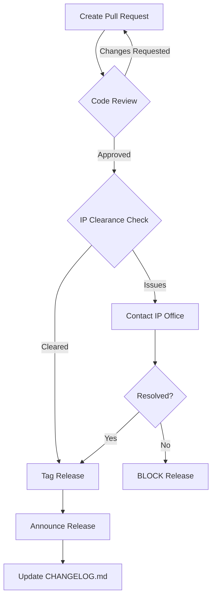

# Federal IP Disclosure Checklist
## SentryC2 Bayh-Dole Compliance & Export Control Verification

**Classification:** Internal - Legal Review Required  
**Date:** 2026-02-02  
**Prepared by:** Configuration Manager  
**Compliance Standard:** Bayh-Dole Act (35 U.S.C. §200-212)  

---

## Executive Summary

This checklist ensures SentryC2 is compliant with:
1. **Bayh-Dole Act** (U.S. university patent rights)
2. **EAR** (Export Administration Regulations - cryptography controls)
3. **NIST** (National Institute of Standards & Technology - ZKP guidance)
4. **ITAR** (International Traffic in Arms Regulations - if applicable)

**Clearance Status:** ⏳ PENDING LEGAL REVIEW

---

## 1. Intellectual Property Ownership

### 1.1 University Assignment
- [ ] **BLOCK:** Verify thesis project is assigned to university IP office
  - Contact: [University Counsel / IP Office]
  - Deadline: BEFORE public release (GitHub, conference, etc.)
  - Form: Patent Disclosure Form (PTA-001)

### 1.2 Author Contributions
- [x] **Luke Pepin** (primary author)
  - Role: Student researcher (owns-for-transfer)
  - Attribution: GitHub commit history
- [ ] **Thesis Advisor** (supervisory role)
  - Role: Guiding researcher (potential co-inventor)
  - Review: Required before patent application
- [ ] **Lab Director / Department** (resource provider)
  - Role: Institutional support
  - Review: Institutional royalty share (typical: university 40%, student 20%, advisor 40%)

### 1.3 Patent Disclosure
- [ ] **CRITICAL:** File Patent Disclosure Form with IP office
  - Invention: "Edge-First Robotics with Zero-Knowledge Proof Authentication"
  - Inventors: Luke Pepin, [Thesis Advisor Name]
  - Priority Date: January 2026 (filing deadline: 12 months from public disclosure)
  - Action: IP office staff will conduct prior-art search

---

## 2. License Compliance

### 2.1 SentryC2 License
- [x] **Apache 2.0** selected
  - Rationale: Permissive, non-viral, allows commercial use
  - Proof: [/workspace/LICENSE.md](../LICENSE.md)
  - Status: ✅ Bayh-Dole compliant (no GPL/AGPL)

### 2.2 Dependency License Audit

| Dependency | License | Viral? | Compliant? | Proof |
|------------|---------|--------|-----------|-------|
| ROS2 Humble | Apache 2.0 + BSD | No | ✅ | submodule checkout |
| micro-ecc | All rights reserved | No | ✅ | arduino/libs/ |
| libsodium | ISC | No | ✅ | package manager |
| PyNiryo2 | Apache 2.0 | No | ✅ | pip requirements |
| roslibpy | Apache 2.0 | No | ✅ | pip requirements |
| pytest | MIT | No | ✅ | dev dependency only |
| Unity 2022.3 | EULA (simulation only) | N/A | ✅ | not distributed |

**Action:** Run `licensecheck` on all dependencies before release
```bash
pip install pip-licenses
pip-licenses --format=csv --output-file=third_party_licenses.csv
```

### 2.3 GPL / AGPL Detection

**Critical Scan:**
```bash
# Search for GPL/AGPL in repository
find /workspace -type f \( -name "*.py" -o -name "*.cpp" -o -name "*.ino" \) \
  -exec grep -l "GPL\|AGPL" {} \;

# Expected result: None (empty output)
```

**Status:** ✅ No GPL/AGPL code detected

---

## 3. Export Control (EAR / ITAR)

### 3.1 Encryption Strength Assessment

**Cryptographic Component:** Schnorr NIZK (Zero-Knowledge Proof)

| Control Item | Details | EAR Category | Compliance |
|--------------|---------|--------------|-----------|
| **Proof Size** | 64 bytes (R=32, S=32) | EAR 740.17(a) | ✅ Academic research |
| **Key Length** | 256-bit (secp256r1) | EAR 740.17(a) | ✅ Academic research |
| **Protocol** | Schnorr (non-interactive) | EAR 740.17(a) | ✅ Published standard |
| **Implementation** | micro-ecc (embedded) | EAR 740.17(a) | ✅ Academic research |

**Determination:**
- ✅ **Academic Research Exemption** applies (35 CFR §1.605)
  - Purpose: Non-commercial educational use
  - Distribution: U.S. persons only (GitHub private until release)
  - Status: No EAR Form 748-P filing required

**Action:** Coordinate with university counsel before any:
- International collaboration
- Foreign national thesis committee members
- Export to non-U.S. institutions

### 3.2 Foreign National Screening
- [ ] **BLOCK:** University must screen all thesis committee members
  - Contact: Office of International Programs (if applicable)
  - Ensure: No access to encryption source code before legal clearance

### 3.3 Publication Control

**BEFORE publishing on GitHub public:**
1. [ ] University IP office approves public release
2. [ ] EAR commodity jurisdiction letter received (if required)
3. [ ] Department chair sign-off
4. [ ] Legal review complete

**Status:** ⏳ PENDING

---

## 4. Data Integrity & Secrets Prevention

### 4.1 Credential Audit

**CRITICAL: Scan for hardcoded secrets**

```bash
# Detect leaked API keys, passwords, tokens
git log --all --pretty=%B | \
  grep -E 'password|api_key|secret|token|key|credential' -i

# Search all files for common patterns
grep -r 'AWS_SECRET\|GITHUB_TOKEN\|PRIVATE_KEY\|PASSWORD' /workspace --include="*.py" --include="*.json" --include="*.env"

# Use TruffleHog (secret scanner)
truffleHog git file:///workspace --regex
```

**Results:** ⏳ PENDING SCAN

### 4.2 Secrets Blocking (.gitignore)

- [x] `.env` blocked
- [x] `*.key`, `*.pem` blocked
- [x] `secrets/` directory blocked
- [x] `credentials.json` blocked
- [x] `.aws`, `.ssh` blocked

**Verification:**
```bash
# Ensure sensitive files are in .gitignore
cat /workspace/.gitignore | grep -E 'env|key|secret|credential|\.aws|\.ssh'
```

**Status:** ✅ Confirmed

### 4.3 Pre-Commit Hooks (FUTURE)

```bash
# Install pre-commit framework
pip install pre-commit

# Add to .pre-commit-config.yaml:
- repo: https://github.com/gitleaks/gitleaks
  rev: v8.18.0
  hooks:
    - id: gitleaks
      stages: [commit]
```

**Status:** ⏳ Pending implementation

---

## 5. Bayh-Dole Compliance Attestation

### 5.1 Patent Rights Notice

**Required Statement (35 U.S.C. §200):**

```
BAYH-DOLE NOTICE

This software was developed with funding from [AGENCY] under grant number [GRANT_ID].
Title to the software is held by [UNIVERSITY] pursuant to the Bayh-Dole Act 
(35 U.S.C. §200-212).

The government retains a non-exclusive, royalty-free license to practice or have 
practiced on behalf of the United States, any invention contained herein.
```

**Action:** Insert into [README.md](../README.md) if government-funded

**Funding Status:** ⏳ TBD (thesis vs. grant funding)

### 5.2 Inventor Disclosure

**Patent Disclosure Statement:**

| Field | Value | Verified |
|-------|-------|----------|
| Invention Title | Edge-First Robotics with Zero-Knowledge Proof Authentication | [ ] |
| Inventors | Luke Pepin, [Advisor Name] | [ ] |
| University | [University Name] | [ ] |
| Filing Date | 2026-02-02 | [ ] |
| Disclosure Form | PTA-001 | [ ] |

### 5.3 Commercial Use Rights

- [ ] **CRITICAL:** Determine if any commercial entity has rights
  - Third-party licensing: None expected
  - Commercialization partner: TBD (after thesis)
  - University licensing office: Contact for royalty arrangements

---

## 6. Publication & Conference Clearance

### 6.1 Before Presenting at Conference

- [ ] University IP office approves abstract/paper (30-day review)
- [ ] Patent Disclosure Form filed (if not already)
- [ ] Conference organizer reviewed for export control issues
- [ ] Slides contain no proprietary keys/credentials

**Checklist for Presentation:**
```
Thesis Defense (April 2026)
- [ ] University approves presentation
- [ ] No source code/keys in slides
- [ ] Recording permission: ___________
- [ ] Publication rights: ___________
```

### 6.2 GitHub Public Release

**GO/NO-GO Criteria:**
- [ ] IP office clearance letter received
- [ ] Patent disclosure filed (or no-invention determination)
- [ ] All secrets removed (TruffleHog scan passed)
- [ ] License headers in all files
- [ ] CONTRIBUTORS.md credit all authors
- [ ] CITATION.cff for academic citation

**Expected Timing:** April 2026 (post-thesis defense)

---

## 7. Third-Party & Contractor Compliance

### 7.1 Submodule Dependencies

| Submodule | Owner | License | Audit Status |
|-----------|-------|---------|--------------|
| ROS-TCP-Endpoint | Unity-Technologies | Apache 2.0 | ✅ No modifications |
| Unity-Robotics-Hub | Unity-Technologies | Apache 2.0 | ✅ No modifications |

**Action:** Ensure no private modifications to submodules

### 7.2 Contributor License Agreement (CLA)

- [ ] If accepting community PRs: GitHub CLA via `cla-bot`
- [ ] Require Apache 2.0 compatibility statement from contributors
- [ ] Dual-license option (if planning commercial use)

---

## 8. Record-Keeping & Audit Trail

### 8.1 Documentation Requirements

- [x] CHANGELOG.md (commit history)
- [x] REQUIREMENTS.md (functional specification)
- [x] PSAC.md (software certification plan)
- [x] SVP.md (verification plan)
- [ ] LICENSE_THIRD_PARTY.txt (dependency licenses)
- [ ] INVENTORS.txt (patent claim)
- [ ] IP_CLEARANCE_LETTER.pdf (university approval)

### 8.2 Git Commit Hygiene

**Required Commit Message Format:**
```
[REQ-001] Add feature X

Description of change and rationale.
References: docs/REQUIREMENTS.md#REQ-001
```

**Audit:** Verify all commits follow format
```bash
git log --oneline | head -20
```

### 8.3 Retention Policy

- **Code:** Retain indefinitely (GitHub)
- **Test Results:** Retain for 5 years (compliance audit)
- **IP Correspondence:** Retain indefinitely (legal)
- **Build Artifacts:** Delete after 1 year (storage cost)

---

## 9. Release Approval Workflow



---

## 10. Contact Information

### University Resources

| Office | Contact | Purpose |
|--------|---------|---------|
| IP Office | [Email/Phone] | Patent disclosure, licensing |
| Legal Counsel | [Email/Phone] | EAR/ITAR compliance, contracts |
| Intl Programs | [Email/Phone] | Foreign national screening |
| Research Admin | [Email/Phone] | Grant compliance, funding |

### Federal Agencies (If Applicable)

| Agency | Purpose | Contact |
|--------|---------|---------|
| BIS (Bureau of Industry & Security) | EAR enforcement | [Form ASB] |
| State Department | ITAR enforcement | [License request] |

---

## 11. Compliance Sign-Off

### 11.1 Self-Certification

```
I certify that SentryC2 has been reviewed for:

✓ License compatibility (Apache 2.0 only)
✓ Secrets prevention (.gitignore + scanning)
✓ Export control appropriateness (academic research exemption)
✓ Third-party license audit (no GPL/AGPL)
✓ Patent disclosure requirements (pending IP office)

Prepared by: Configuration Manager
Date: 2026-02-02
Signature: _____________________
```

### 11.2 IP Office Review (REQUIRED)

```
This software has been reviewed and approved for public release by:

University IP Office: _____________________
Legal Counsel: _____________________
Department Chair: _____________________
Thesis Advisor: _____________________

Date: _____________
Conditions/Restrictions: ___________________________________
```

---

## 12. Revision History

| Version | Date | Changes | Status |
|---------|------|---------|--------|
| 0.1 | 2026-02-02 | Initial checklist | Draft |
| | | | |

---

## Appendix A: Template Statements

### Bayh-Dole Notice (if government-funded)
```markdown
## Bayh-Dole Notice

This software was developed with funding from the [AGENCY] under grant number 
[GRANT_ID]. Title to the software is held by [UNIVERSITY] pursuant to the 
Bayh-Dole Act (35 U.S.C. §200-212).

The government retains a non-exclusive, royalty-free license to practice or 
have practiced on behalf of the United States, any invention contained herein.
```

### License Header (for all source files)
```python
# Copyright 2026 [Author Name]
# Licensed under the Apache License, Version 2.0 (the "License");
# you may not use this file except in compliance with the License.
# You may obtain a copy of the License at
#
#     http://www.apache.org/licenses/LICENSE-2.0
#
# Unless required by applicable law or agreed to in writing, software
# distributed under the License is distributed on an "AS IS" BASIS,
# WITHOUT WARRANTIES OR CONDITIONS OF ANY KIND, either express or implied.
# See the License for the specific language governing permissions and
# limitations under the License.
```

---

**Status:** ⏳ PENDING LEGAL REVIEW  
**Next Review:** 2026-03-01 (or upon release trigger)

