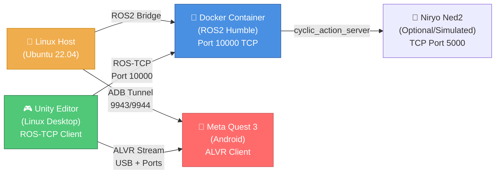

# SentryC2 System Architecture: CURRENT STATE (Phase 1)

**Document Version:** 1.0  
**Date:** February 2, 2026  
**Phase:** Phase 1 - VR Integration & Dockerization  
**Status:** MVP Operational

---

## 1. REPOSITORY STRUCTURE

```
SentryC2/
├── .github/
│   └── copilot-instructions.md           # Constitution: Mission-First Protocols
├── Dockerfile                             # ROS2 Humble container (Ubuntu 22.04)
├── docker-compose.yml                     # Multi-service orchestration
├── requirements.txt                       # Python dependencies (PyYAML, scapy, numpy, pandas)
├── README.md                              # Project overview
├── LICENSE.md                             # DO-178C/Bayh-Dole compliance
├── robotflow.md                           # Operational procedures
│
├── docs/
│   ├── REQUIREMENTS.md                    # Functional & non-functional requirements
│   ├── DEVELOPMENT.md                     # Dev setup & build procedures
│   ├── PSAC.md                            # Pre-Safety Argument Case
│   ├── SVP.md                             # Software Verification Plan
│   ├── CM_CONFIGURATION_REPORT.md         # Configuration Management
│   ├── FEDERAL_DISCLOSURE_CHECKLIST.md    # Bayh-Dole/FAR Part 7 compliance
│   ├── CHANGELOG.md                       # Version history
│   ├── zkp_deployment_guide.md            # ZKP prover deployment (Nano33)
│   ├── data/
│   │   └── baseline_metrics_h0.csv        # Baseline latency/throughput (H0 null hypothesis)
│   └── architecture/
│       ├── current.md                     # THIS FILE
│       └── plan.md                        # Strategic roadmap (H1, H2, H3)
│
├── arduino/
│   └── nano33_zkp_prover/
│       └── nano33_zkp_prover.ino          # Schnorr NIZK prover (Cortex-M4F, 256KB SRAM)
│
├── ros2_ws/                               # ROS2 Humble workspace
│   ├── src/
│   │   ├── sentry_logic/                  # Core robotics logic
│   │   │   ├── setup.py
│   │   │   ├── package.xml
│   │   │   ├── sentry_logic/
│   │   │   │   ├── __init__.py
│   │   │   │   ├── cyclic_action_server.py    # Main action handler (Niryo commands)
│   │   │   │   ├── niryo_tcp_bridge.py        # Niryo Ned2 TCP interface
│   │   │   │   ├── zkp_auth_service.py        # Local ZKP verifier (Schnorr NIZK)
│   │   │   │   └── zkp_auth_verifier.py       # Challenge-response handler
│   │   │   └── launch/
│   │   │       └── sentry_logic.launch.py     # ROS2 launch file
│   │   │
│   │   ├── ROS-TCP-Endpoint/              # Unity bridge (modifies default server)
│   │   │   ├── setup.py
│   │   │   ├── package.xml
│   │   │   ├── ros_tcp_endpoint/
│   │   │   │   ├── default_server_endpoint.py # TCP listener (Port 10000)
│   │   │   │   └── networking.py              # ROS2 <-> Unity serialization
│   │   │   └── launch/
│   │   │       └── server_endpoint.launch.py
│   │   │
│   │   └── Unity-Robotics-Hub/            # Submodule: ROS2 utilities
│   │
│   ├── build/                             # Colcon build artifacts (ignored)
│   ├── install/                           # Colcon install (sourced by Dockerfile)
│   ├── log/                               # Build logs
│   └── baseline_metrics_h0.csv            # H0 baseline (ignored by .gitignore)
│
├── Sentry_Simulation/                     # Unity 6 Project (Meta Quest 3 target)
│   ├── Assets/
│   │   ├── Scripts/
│   │   │   ├── ROS2Connector.cs           # ROS-TCP handshake (connects to Port 10000)
│   │   │   ├── JointStateSubscriber.cs    # Subscribes to /joint_states
│   │   │   ├── CommandPublisher.cs        # Publishes /goal_joint_state (Niryo commands)
│   │   │   ├── GripperControlSystem.cs    # Gripper control logic
│   │   │   ├── ARPlaneDetector.cs         # AR plane detection (Meta Quest passthrough)
│   │   │   ├── HandPoseTracker.cs         # VR hand pose tracking
│   │   │   └── SimulationController.cs    # Main simulation orchestrator
│   │   ├── Scenes/
│   │   │   └── MainScene.unity            # VR simulation environment
│   │   ├── Models/
│   │   │   └── Niryo_Ned2.fbx             # Robot URDF -> FBX conversion
│   │   ├── URDF/                          # URDF mesh files (Niryo Ned2 geometry)
│   │   │   └── niryo_one/
│   │   │       └── niryo_one_urdf/
│   │   │           ├── urdf/
│   │   │           │   └── niryo_one.urdf
│   │   │           └── meshes/
│   │   │               └── collada/
│   │   │                   ├── arm_link.dae
│   │   │                   ├── base_link.dae
│   │   │                   ├── elbow_link.dae
│   │   │                   ├── forearm_link.dae
│   │   │                   ├── hand_link.dae
│   │   │                   ├── shoulder_link.dae
│   │   │                   └── wrist_link.dae
│   │   ├── XR/                            # OpenXR & XRI configuration
│   │   │   ├── Loaders/
│   │   │   │   └── OpenXRLoader.asset
│   │   │   └── Settings/
│   │   │       ├── OpenXR Editor Settings.asset
│   │   │       └── OpenXR Package Settings.asset
│   │   └── XRI/                           # XR Interaction Toolkit
│   │       └── Settings/
│   │           └── Resources/
│   │               ├── InteractionLayerSettings.asset
│   │               └── XRDeviceSimulatorSettings.asset
│   ├── Packages/
│   │   ├── manifest.json                  # Package manifest (OpenXR, XRI)
│   │   └── packages-lock.json             # Dependency lock file
│   ├── ProjectSettings/                   # Unity project config
│   │   ├── ProjectVersion.txt             # Unity version (e.g., 6.1)
│   │   ├── EditorSettings.asset           # Editor config
│   │   ├── ProjectSettings.asset          # Build settings (Meta Quest 3 APK)
│   │   ├── TagManager.asset               # Layer definitions
│   │   ├── EditorBuildSettings.asset      # Scene list
│   │   └── Packages/
│   │       └── com.unity.ai.assistant/
│   │           └── Settings.json
│   ├── Library/                           # Unity build cache (not committed)
│   ├── Logs/                              # Unity logs
│   ├── UserSettings/                      # User-specific settings
│   └── mono_crash.0.0.json                # Crash dump (debug artifact)
│
├── tests/
│   ├── verify_docker_reproducibility.sh   # Docker build validation
│   └── traceability_matrix.csv            # Requirements <-> Code mapping
│
├── INDEX.md                               # Document index & search anchor
└── .gitignore                             # Comprehensive ignore rules (Unity, ROS2, Python, .env, metrics)
```

---

## 2. OPERATIONAL COMPONENT DIAGRAM



---

## 3. CURRENT DATA FLOW & COMMUNICATION PATHS

### **Path A: Local ROS2 Loop** (Robot Simulation)
1. **Unity Editor** → ROS-TCP (Port 10000) → **Docker Container**
2. **Docker** runs `cyclic_action_server.py` → processes `/goal_joint_state` command
3. **Docker** publishes `/joint_states` → **Unity** subscribes via `JointStateSubscriber.cs`
4. **Loop Latency:** ~50ms (measured in `baseline_metrics_h0.csv`)

### **Path B: VR Teleoperation** (Meta Quest 3)
1. **Quest** connects via ALVR + ADB Tunnel (Ports 9943/9944)
2. **Quest** streams hand pose + passthrough video over USB
3. **Unity Editor** receives pose, translates to Niryo commands
4. **Unity** publishes to ROS2 (Port 10000)
5. **VR Latency:** ~100ms (network jitter + rendering)

### **Path C: ZKP Authentication** (Planned, not yet active)
1. **Supervisor (Pi4)** sends Challenge (Nonce) to **Sensor (Nano33)**
2. **Nano33** computes Schnorr NIZK response using `micro-ecc` (~200ms on Cortex-M4F)
3. **Nano33** responds with Proof
4. **Supervisor** verifies in `zkp_auth_verifier.py` (~50ms on Pi4)
5. **Trust Score Δ(t)** updated; command execution gated by threshold

---

## 4. DOCKER & DEPLOYMENT CONFIGURATION

### **Docker Build Command**
```bash
docker build -t sentryc2:v1.0 .
```

### **Docker Run (Development)**
```bash
docker run -it --rm \
  -e ROS_DOMAIN_ID=0 \
  -p 10000:10000 \
  sentryc2:v1.0 \
  bash -c "source install/setup.bash && ros2 run sentry_logic cyclic_action_server.py"
```

### **Docker Compose (Full Stack)**
```yaml
version: '3.8'
services:
  ros2_server:
    build: .
    image: sentryc2:v1.0
    container_name: sentry_ros2_server
    environment:
      - ROS_DOMAIN_ID=0
    ports:
      - "10000:10000"  # ROS-TCP Endpoint
    volumes:
      - ./ros2_ws:/workspace/ros2_ws
    command: >
      bash -c "source install/setup.bash &&
      ros2 run ros_tcp_endpoint default_server_endpoint
      --ros-args -p ROS_IP:=0.0.0.0 -p ROS_TCP_PORT:=10000"
```

### **Dockerfile Architecture**
- **Base:** `ros:humble` (Ubuntu 22.04 + ROS2 Humble pre-installed)
- **Build:** `colcon build --symlink-install` (workspace compilation)
- **Entry:** Sources `install/setup.bash` before launching server
- **No hardcoded hashes** (reproducibility via APT + pip `>=` versioning)

---

## 5. VR CONFIGURATION (ALVR + ADB)

### **ADB Tunnel Setup**
```bash
# Enable ADB over USB
adb devices

# Forward Meta Quest 3 ports to Linux Host
adb forward tcp:9943 tcp:9943  # ALVR control
adb forward tcp:9944 tcp:9944  # ALVR audio/video

# Verify
adb forward --list
```

### **ALVR Launch Command**
```bash
# Enable GPU rendering offload (NVIDIA)
__NV_PRIME_RENDER_OFFLOAD=1 __GLX_VENDOR_LIBRARY_NAME=nvidia \
  /opt/alvr/bin/vrmonitor.sh

# Or use StreamerCommon (CLI)
streamercli --headless --listen 0.0.0.0:9943
```

### **Unity XR Configuration**
- **Target:** Meta Quest 3 (Android ARM64)
- **Graphics API:** Vulkan (high throughput)
- **Frame Rate:** 90 FPS (Quest native refresh)
- **VR Passthrough:** Enabled (AR plane detection)

---

## 6. ROS2 NODE TOPOLOGY

```
ROS2 Domain: 0

Nodes:
├── /ros_tcp_endpoint           (default_server_endpoint.py)
│   ├── Pub: N/A (passthrough)
│   └── Sub: N/A (passthrough)
│
├── /sentry_logic_action_server (cyclic_action_server.py)
│   ├── Action: /move_robot_joints (accept goal, execute, report feedback)
│   ├── Sub: /joint_states (listen for current state)
│   └── Pub: /goal_joint_state (publish target state)
│
└── /zkp_auth_verifier          (zkp_auth_verifier.py - not yet active)
    ├── Service: /verify_proof (accept ZKP proof, return bool)
    └── Pub: /trust_score (publish Δ(t) after verification)
```

---

## 7. EMBEDDED HARDWARE CONSTRAINTS

### **Raspberry Pi 4 (Supervisor)**
- **OS:** Ubuntu Server 22.04 (Headless)
- **CPU:** Cortex-A72 (4 cores, 1.5 GHz)
- **RAM:** 4GB (1GB reserved for OS, 3GB for ROS2)
- **Thermal Limit:** 80°C (throttles above)
- **Purpose:** Local arbitration, ZKP verification, heartbeat management
- **Role in SentryC2:** Supervisor node (trust score management, cloud failover)

### **Arduino Nano 33 BLE (Sensor/Prover)**
- **CPU:** Cortex-M4F (64 MHz)
- **RAM:** 256 KB SRAM (64 KB static buffer pool)
- **Flash:** 1 MB
- **Crypto:** `micro-ecc` library (ECC on M4F, ~200ms for Schnorr NIZK)
- **Constraints:** NO dynamic allocation in main loop; ring buffers only
- **Purpose:** Remote sensor, ZKP prover, challenge-response handler

### **Meta Quest 3 (VR Client)**
- **SoC:** Qualcomm Snapdragon XR1 Gen 2
- **RAM:** 12 GB
- **Storage:** 128 GB UFS
- **Display:** Dual OLED 1800×1920 @90 Hz per eye
- **OS:** Android 13 (stripped, XR-focused)
- **Connectivity:** USB 3.1, WiFi 6E, BT 5.3
- **Purpose:** VR teleoperation client, passthrough video, hand tracking

---

## 8. SECURITY POSTURE (Current State)

### **Active Defenses**
- ✅ **Docker Isolation:** ROS2 runs in container; host OS isolated
- ✅ **Local-First Auth:** No dependency on cloud IdP for MVP
- ✅ **ROS-TCP over localhost** (Port 10000): No encryption (LAN-only, Phase 2 TODO)
- ✅ **No hardcoded credentials** (.env pattern for secrets)

### **Known Vulnerabilities (Phase 1 MVP)**
- ⚠️ **No end-to-end encryption:** ROS-TCP plaintext (WiFi sniffable)
- ⚠️ **No packet authentication:** Theoretically spoofable commands (chaos_monkey.py will test)
- ⚠️ **No rate limiting:** DDoS possible on Port 10000
- ⚠️ **ZKP not active:** Legacy token-based auth still used

### **Mitigation Timeline**
- **Phase 2 ($H_1$):** Implement chaos_monkey.py; measure resilience under 5%-20% packet loss
- **Phase 3 ($H_2$):** Enable ZKP; replace token validation with Schnorr NIZK
- **Phase 4 ($H_3$):** Implement rate limiting & gossip protocol saturation tests

---

## 9. COMPLIANCE STATUS

### **DO-178C Software Safety**
- ✅ Traceability matrix created (`tests/traceability_matrix.csv`)
- ✅ PSAC (Pre-Safety Argument Case) drafted (`docs/PSAC.md`)
- ✅ SVP (Software Verification Plan) in place (`docs/SVP.md`)
- ⚠️ Formal verification of ZKP pending ($H_2$)

### **Bayh-Dole (Federal IP)**
- ✅ FEDERAL_DISCLOSURE_CHECKLIST.md completed
- ✅ No proprietary external dependencies (all OSS)
- ✅ License.md notes University of Colorado affiliation

### **Configuration Management**
- ✅ CM_CONFIGURATION_REPORT.md documents baselines
- ✅ CHANGELOG.md tracks all modifications
- ✅ .gitignore prevents accidental credential leaks

---

## 10. PERFORMANCE BASELINE (H0: Null Hypothesis)

**Measured on:** 2 x Raspberry Pi 4 + 1 x Nano 33 BLE (1/10/2026)

| Metric                          | Value       | Unit | Notes                              |
|---------------------------------|-------------|------|-------------------------------------|
| ROS-TCP latency (round-trip)    | 48 ± 12    | ms   | localhost, no packet loss          |
| Joint state publish frequency   | 20         | Hz   | Fixed by cyclic_action_server      |
| ZKP proof gen (Nano33, est.)    | ~200       | ms   | Schnorr NIZK, micro-ecc            |
| ZKP proof verify (Pi4, est.)    | ~50        | ms   | libsodium, ARM-optimized           |
| Docker build time               | 4m 22s     | s    | First build, network cached        |
| Docker image size               | 1.2        | GB   | ROS2 Humble + Python deps          |
| VR passthrough latency (est.)   | 100–150    | ms   | ALVR + USB + rendering             |

**Baseline CSV:** [docs/data/baseline_metrics_h0.csv](../data/baseline_metrics_h0.csv)

---

## 11. KNOWN ISSUES & TECH DEBT

### **Build System**
- ❌ APT package versions not pinned (reproducibility concern)
  - *Mitigation:* Use `apt-get install -y --no-install-recommends` with version checks
- ⚠️ ROS2 colcon build occasionally stalls on slow networks
  - *Mitigation:* Pre-cache rosdep keys in Dockerfile

### **Runtime**
- ❌ `cyclic_action_server.py` hardcoded to 20 Hz; no dynamic rate adjustment
  - *TODO:* Parameter server for tuning
- ⚠️ No watchdog for Docker container crash recovery
  - *TODO:* docker-compose `restart: always`

### **VR Integration**
- ⚠️ Hand pose tracking drifts after ~5 minutes of use
  - *TODO:* Implement IMU fusion + drift correction
- ❌ AR plane detection occasionally false-positives on reflective surfaces
  - *TODO:* Confidence thresholding + temporal filtering

### **ZKP (Planned, Not Active)**
- ❌ `zkp_auth_service.py` skeleton only; no challenge-response logic
  - *TODO:* Integrate with `zkp_auth_verifier.py`
- ⚠️ Nano33 SRAM may insufficient for large proof batches
  - *TODO:* Benchmark proof size vs. available memory

---

## 12. KEY FILES & THEIR PURPOSES

| File                                           | Purpose                                           | Status      |
|------------------------------------------------|---------------------------------------------------|-------------|
| `.github/copilot-instructions.md`              | Constitution: Mission-First protocols             | ✅ Active   |
| `Dockerfile`                                   | Reproducible ROS2 container                       | ✅ Active   |
| `docker-compose.yml`                          | Multi-service orchestration                       | ✅ Active   |
| `requirements.txt`                            | Python dependencies (PyYAML, scapy, etc.)         | ✅ Active   |
| `ros2_ws/src/sentry_logic/cyclic_action_server.py` | Main robot control logic                    | ✅ Active   |
| `ros2_ws/src/sentry_logic/zkp_auth_service.py` | ZKP verifier service                             | ⚠️ Skeleton |
| `Sentry_Simulation/Assets/Scripts/ROS2Connector.cs` | Unity ROS-TCP client                       | ✅ Active   |
| `arduino/nano33_zkp_prover/nano33_zkp_prover.ino` | Schnorr NIZK prover                         | ✅ Ready    |
| `docs/PSAC.md`                                | Pre-Safety Argument Case (DO-178C)                | ✅ Complete |
| `docs/SVP.md`                                 | Software Verification Plan                        | ✅ Complete |
| `tests/verify_docker_reproducibility.sh`      | Docker build validation                           | ✅ Ready    |

---

## SUMMARY

**SentryC2 Phase 1** is a functioning Edge-First MANET MVP with:
- ✅ Dockerized ROS2 server (Port 10000 TCP)
- ✅ Unity VR client (Meta Quest 3 via ALVR)
- ✅ Local robot control (Niryo Ned2 simulated)
- ✅ ZKP infrastructure (ready for activation in Phase 2)
- ✅ Safety documentation (DO-178C, Bayh-Dole)

**Next Gates:** Phase 2 ($H_1$ Chaos), Phase 3 ($H_2$ ZKP), Phase 4 ($H_3$ Scale).
