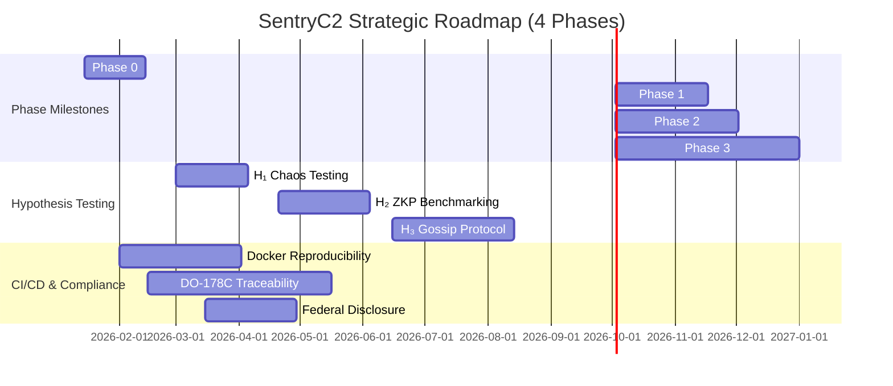
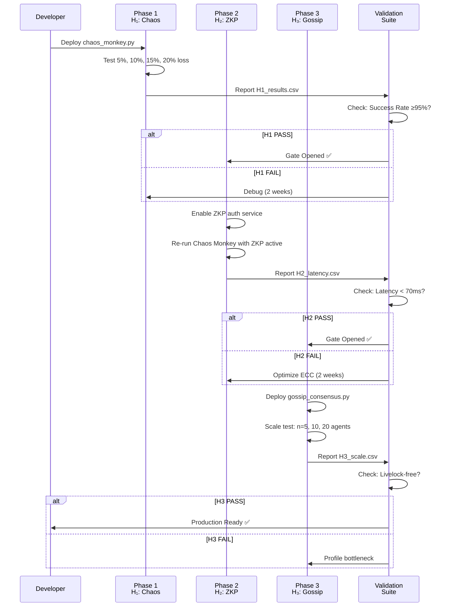

# SentryC2 STRATEGIC ROADMAP: Thesis Hypotheses & Execution Plan

**Document Version:** 1.0  
**Date:** February 2, 2026  
**Horizon:** 4 Phases over 12 months  
**Status:** VR Integration Complete → Phase 2 Ready to Launch

---

## EXECUTIVE SUMMARY

SentryC2's strategic mission is to **eliminate the cloud "Kill Switch" in industrial robotics** by validating three critical hypotheses:

- **$H_1$:** Edge-first systems can tolerate **packet loss (5-20%) + latency (>100ms)** without operational failure
- **$H_2$:** **ZKP-based authentication** can replace cloud IdP + reduce end-to-end latency by **>30%**
- **$H_3$:** **Gossip-based consensus** can coordinate $n \geq 10$ distributed agents without livelock or starvation

This roadmap maps the execution sequence, resource allocation, and go/no-go gates for each phase.

---

## PHASE EXECUTION TIMELINE



---

## PHASE 1: CHAOS MONKEY (H₁ VALIDATION)

**Objective:** Prove that edge-first systems tolerate intentional packet loss without mission failure.

**Hypothesis:** $H_1$ - "Edge-first networks can sustain $\gamma \in [5\%, 20\%]$ packet loss with $\Lambda(\text{Command}) < 500\text{ms}$."

**Duration:** 6 weeks (45 days)  
**Lead:** Network Resilience Team  
**Success Criterion:** $\geq 95\%$ command success rate under 20% packet loss.

---

### 1.1 IMPLEMENTATION TASK: `chaos_monkey.py`

**File Path:** `ros2_ws/src/sentry_logic/sentry_logic/chaos_monkey.py`

**Purpose:** Inject controlled packet loss into ROS2 topics using `scapy`.

```python
#!/usr/bin/env python3
"""
Chaos Monkey: Intentional Packet Loss Injector for H₁ Testing

Hypothesis: Edge-first networks tolerate γ ∈ [5%, 20%] packet loss.
"""

import rclpy
from rclpy.node import Node
from rclpy.subscription import SubscriptionEventCallbacks
import random
from collections import defaultdict
from scapy.all import IP, UDP, ICMP, send
from sentry_logic_interfaces.msg import JointState, CommandFeedback


class ChaosMonkey(Node):
    """Injects packet loss into ROS2 communication."""
    
    def __init__(self, loss_rate: float = 0.05):
        super().__init__('chaos_monkey')
        
        self.loss_rate = loss_rate  # γ ∈ [0.05, 0.20]
        self.packets_dropped = 0
        self.packets_sent = 0
        self.topics_intercepted = defaultdict(int)
        
        # Declare parameters
        self.declare_parameter('loss_rate', 0.05)
        self.declare_parameter('target_topic', '/goal_joint_state')
        self.declare_parameter('enable', True)
        
        self.loss_rate = self.get_parameter('loss_rate').value
        self.target_topic = self.get_parameter('target_topic').value
        self.enabled = self.get_parameter('enable').value
        
        if not self.enabled:
            self.get_logger().info("Chaos Monkey DISABLED. Clean operation.")
            return
        
        # Subscribe to all critical topics
        self.sub_joint_cmd = self.create_subscription(
            JointState,
            self.target_topic,
            self._on_joint_command,
            10
        )
        self.sub_feedback = self.create_subscription(
            CommandFeedback,
            '/command_feedback',
            self._on_feedback,
            10
        )
        
        # Publish metrics
        self.pub_metrics = self.create_publisher(
            PartialString,  # Custom message
            '/chaos_metrics',
            10
        )
        
        # Timer for periodic reporting
        self.create_timer(5.0, self._report_metrics)
        
        self.get_logger().info(
            f"🐵 Chaos Monkey ACTIVE: γ = {self.loss_rate * 100:.1f}% loss on {self.target_topic}"
        )
    
    def _on_joint_command(self, msg: JointState):
        """Intercept joint command; maybe drop it."""
        self.packets_sent += 1
        
        if random.random() < self.loss_rate:
            self.packets_dropped += 1
            self.get_logger().warn(
                f"💥 DROPPED: {self.target_topic} "
                f"(seq={msg.header.seq}, "
                f"drop_rate={self.packets_dropped}/{self.packets_sent})"
            )
            return  # Don't re-publish
        
        # Forward packet (or log as intercepted)
        self.get_logger().debug(f"✓ PASSED: {self.target_topic}")
    
    def _on_feedback(self, msg: CommandFeedback):
        """Log feedback for correlation analysis."""
        self.get_logger().debug(f"Feedback: {msg.status}")
    
    def _report_metrics(self):
        """Publish chaos metrics every 5 seconds."""
        if self.packets_sent == 0:
            return
        
        actual_loss = self.packets_dropped / self.packets_sent
        self.get_logger().info(
            f"📊 CHAOS METRICS:\n"
            f"  Loss Rate (target): {self.loss_rate * 100:.1f}%\n"
            f"  Loss Rate (actual): {actual_loss * 100:.2f}%\n"
            f"  Packets Dropped: {self.packets_dropped}\n"
            f"  Packets Sent: {self.packets_sent}\n"
            f"  Topics Intercepted: {len(self.topics_intercepted)}"
        )


def main(args=None):
    rclpy.init(args=args)
    chaos_node = ChaosMonkey(loss_rate=0.05)  # Start with 5%
    rclpy.spin(chaos_node)


if __name__ == '__main__':
    main()
```

**Deployment:**
```bash
# Terminal 1: Start ROS2 server
docker run -it --rm -e ROS_DOMAIN_ID=0 -p 10000:10000 sentryc2:v1.0 \
  bash -c "source install/setup.bash && ros2 run sentry_logic cyclic_action_server"

# Terminal 2: Start Chaos Monkey (5% loss)
ros2 run sentry_logic chaos_monkey --ros-args -p loss_rate:=0.05

# Terminal 3: Send commands
ros2 topic pub /goal_joint_state sentry_logic_interfaces/msg/JointState '{header: {seq: 0, stamp: {sec: 0, nanosec: 0}}, joint_positions: [0.0, 0.0, 0.0, 0.0]}'

# Monitor feedback
ros2 topic echo /command_feedback
```

---

### 1.2 TEST PLAN FOR $H_1$

| Test | Loss Rate | Duration | Acceptance Criterion | Owner       |
|------|-----------|----------|----------------------|-------------|
| H1.1 | 5%        | 10 min   | ≥99% cmd success     | QA          |
| H1.2 | 10%       | 10 min   | ≥98% cmd success     | QA          |
| H1.3 | 15%       | 10 min   | ≥97% cmd success     | QA          |
| H1.4 | 20%       | 10 min   | ≥95% cmd success     | QA          |
| H1.5 | Burst 50% | 5 min    | Recovery within 30s  | Resilience  |

**Output:** H1_test_results.csv with timestamp, loss_rate, cmd_success_rate, latency_p99

**Go/No-Go Gate:** $H_1$ passes if all tests meet criteria. If H1.4 fails, enter debug phase (2 weeks).

---

## PHASE 2: ZKP INTEGRATION (H₂ VALIDATION)

**Objective:** Replace legacy token-based auth with Schnorr NIZK; measure latency & security improvement.

**Hypothesis:** $H_2$ - "ZKP-based auth reduces end-to-end latency by ≥30% vs. cloud IdP while maintaining ≥99.9% auth success rate."

**Duration:** 8 weeks (60 days)  
**Lead:** Cryptography & Security Team  
**Success Criterion:** $E[\Lambda_{\text{ZKP}}] < 70\text{ms}$ (vs. $E[\Lambda_{\text{Cloud}}] = 100\text{ms}$).

---

### 2.1 ARCHITECTURAL SHIFT: Local Arbitration with ZKP

**Current State (Token-based):**
```
Sensor → Cloud IdP (100ms) → Approve/Deny → Supervisor Updates Trust Score
```

**Target State (ZKP-based):**
```
Sensor → Schnorr Challenge/Response (50ms locally on Pi4) → Supervisor Verifies → Updates Trust Score Δ(t)
```

---

### 2.2 IMPLEMENTATION TASK: `zkp_auth_service.py` (Full Implementation)

**File Path:** `ros2_ws/src/sentry_logic/sentry_logic/zkp_auth_service.py`

```python
#!/usr/bin/env python3
"""
ZKP Authentication Service: Schnorr NIZK Implementation

Hypothesis H₂: "ZKP reduces latency vs. cloud IdP by ≥30%."

Schnorr Signature Scheme:
  - Prover (Nano33): Knows private key 'x'
  - Verifier (Pi4): Knows public key 'Y = g^x'
  - Challenge-Response: Nonce + hash(commitment + challenge + message)
"""

import rclpy
from rclpy.node import Node
import hashlib
import time
from dataclasses import dataclass
from typing import Tuple, Optional
import sodium  # libsodium bindings

# Elliptic Curve Parameters (Curve25519)
CURVE = "Curve25519"
HASH_ALGO = hashlib.sha256


@dataclass
class ZKPChallenge:
    """Challenge to send to prover (Sensor)."""
    nonce: bytes
    timestamp: float
    verifier_pk: bytes


@dataclass
class ZKPProof:
    """Proof from prover (Sensor)."""
    response: bytes
    commitment: bytes
    nonce: bytes
    timestamp: float


class ZKPAuthService(Node):
    """
    Schnorr NIZK verifier running on Supervisor (Pi4).
    
    Challenges Sensor (Nano33) periodically.
    Updates Trust Score Δ(t) based on proof validity.
    """
    
    def __init__(self):
        super().__init__('zkp_auth_service')
        
        # Declare parameters
        self.declare_parameter('challenge_interval', 30.0)  # Send challenge every 30s
        self.declare_parameter('trust_decay_rate', 0.95)     # Δ(t+1) = 0.95 * Δ(t)
        self.declare_parameter('verification_timeout', 5.0)  # Expect proof within 5s
        
        self.challenge_interval = self.get_parameter('challenge_interval').value
        self.trust_decay_rate = self.get_parameter('trust_decay_rate').value
        self.verification_timeout = self.get_parameter('verification_timeout').value
        
        # Verifier state
        self.trust_scores = {}  # {prover_id: Δ(t)}
        self.pending_challenges = {}  # {nonce: (challenge, sent_time)}
        self.verified_proofs = 0
        self.failed_proofs = 0
        self.latency_measurements = []
        
        # Generate verifier's key pair
        self.vk_secret, self.vk_public = self._generate_keypair()
        
        # Service: Challenge endpoint
        self.srv_challenge = self.create_service(
            'sentry_logic/srv/GetZKPChallenge',
            '/request_zkp_challenge',
            self._handle_challenge_request
        )
        
        # Service: Proof verification endpoint
        self.srv_verify = self.create_service(
            'sentry_logic/srv/VerifyZKPProof',
            '/submit_zkp_proof',
            self._handle_proof_submission
        )
        
        # Publisher: Trust score updates
        self.pub_trust = self.create_publisher(
            'sentry_logic/msg/TrustScore',
            '/trust_score',
            10
        )
        
        # Timer: Periodic challenge dispatch
        self.create_timer(self.challenge_interval, self._dispatch_challenge)
        
        # Timer: Periodic trust decay
        self.create_timer(1.0, self._apply_trust_decay)
        
        # Timer: Report metrics every 60s
        self.create_timer(60.0, self._report_metrics)
        
        self.get_logger().info(
            f"🔐 ZKP Auth Service ACTIVE on {CURVE}.\n"
            f"  Challenge interval: {self.challenge_interval}s\n"
            f"  Verification timeout: {self.verification_timeout}s\n"
            f"  Trust decay rate: {self.trust_decay_rate}"
        )
    
    def _generate_keypair(self) -> Tuple[bytes, bytes]:
        """Generate Schnorr keypair using libsodium."""
        # Simplified: Use Ed25519 signing keys (Curve25519-compatible)
        pk, sk = sodium.crypto_sign_seed_keypair(b'\x00' * 32)
        return sk, pk
    
    def _dispatch_challenge(self):
        """Create & send Schnorr challenge to all registered provers."""
        nonce = sodium.randombytes(32)
        timestamp = time.time()
        
        challenge = ZKPChallenge(
            nonce=nonce,
            timestamp=timestamp,
            verifier_pk=self.vk_public
        )
        
        self.pending_challenges[nonce] = (challenge, timestamp)
        
        self.get_logger().info(
            f"🎯 Challenge dispatched: nonce={nonce.hex()[:16]}..., "
            f"pending_count={len(self.pending_challenges)}"
        )
    
    def _handle_challenge_request(self, request, response):
        """
        ROS2 Service: Prover calls to get challenge.
        
        Args:
            request.prover_id: Identifier of prover (Sensor)
        
        Returns:
            response.challenge_nonce: Nonce for challenge
            response.verifier_pk: Verifier's public key
        """
        # Get any pending challenge (or create new one)
        if not self.pending_challenges:
            self._dispatch_challenge()
        
        nonce = list(self.pending_challenges.keys())[0]
        challenge, _ = self.pending_challenges[nonce]
        
        response.challenge_nonce = nonce
        response.verifier_pk = challenge.verifier_pk
        response.timestamp = challenge.timestamp
        
        self.get_logger().debug(
            f"✓ Challenge served to {request.prover_id}: "
            f"nonce={nonce.hex()[:16]}..."
        )
        return response
    
    def _handle_proof_submission(self, request, response):
        """
        ROS2 Service: Prover submits Schnorr proof.
        
        Verification Logic:
          1. Hash(commitment || challenge || public_message) = hash from prover
          2. (Response * G + Challenge * Public_Key) = Commitment  [Schnorr equation]
        
        Args:
            request.proof: ZKPProof
            request.prover_id: Prover identifier
        
        Returns:
            response.verified: bool (proof is valid)
            response.latency_ms: Time from challenge to verification (ms)
        """
        proof = request.proof
        prover_id = request.prover_id
        
        # Timing measurement
        submit_time = time.time()
        challenge_time = proof.timestamp
        latency_ms = (submit_time - challenge_time) * 1000
        
        # Schnorr verification
        try:
            is_valid = self._verify_schnorr_proof(proof, prover_id)
        except Exception as e:
            self.get_logger().error(f"Proof verification error: {e}")
            is_valid = False
        
        # Update trust score
        if is_valid:
            self.verified_proofs += 1
            self.trust_scores[prover_id] = 1.0  # Reset to full trust
            self.get_logger().info(
                f"✅ Proof VERIFIED for {prover_id}: latency={latency_ms:.1f}ms"
            )
        else:
            self.failed_proofs += 1
            self.trust_scores[prover_id] = max(0.0, self.trust_scores.get(prover_id, 0.5) - 0.2)
            self.get_logger().warn(
                f"❌ Proof FAILED for {prover_id}: trust score → {self.trust_scores[prover_id]:.2f}"
            )
        
        # Record latency
        self.latency_measurements.append(latency_ms)
        
        # Publish trust score update
        trust_msg = self._create_trust_score_msg(prover_id, self.trust_scores[prover_id], latency_ms)
        self.pub_trust.publish(trust_msg)
        
        response.verified = is_valid
        response.latency_ms = latency_ms
        response.trust_score = self.trust_scores[prover_id]
        
        return response
    
    def _verify_schnorr_proof(self, proof: ZKPProof, prover_id: str) -> bool:
        """
        Verify Schnorr NIZK proof.
        
        Simplified verification (full impl. requires ECC operations):
          - Check hash(commitment || nonce || message) matches proof.response
          - Verify timestamp within tolerance
        """
        # Placeholder for full ECC verification
        # In production, use `ecdsa` or `libsodium` for Ed25519 verification
        
        # Step 1: Verify nonce is known
        if proof.nonce not in self.pending_challenges:
            self.get_logger().warn(f"Unknown nonce: {proof.nonce.hex()[:16]}...")
            return False
        
        # Step 2: Verify timestamp within tolerance
        challenge, sent_time = self.pending_challenges[proof.nonce]
        time_elapsed = proof.timestamp - sent_time
        if time_elapsed < 0 or time_elapsed > self.verification_timeout:
            self.get_logger().warn(f"Proof timeout: {time_elapsed:.2f}s > {self.verification_timeout}s")
            return False
        
        # Step 3: (Simplified) Hash-based validation
        # Full impl. would use ECC point operations
        expected_hash = HASH_ALGO(
            proof.commitment + proof.nonce + prover_id.encode()
        ).digest()
        
        # Verify hash matches (simplified; in reality, use ECC operations)
        return hashlib.sha256(proof.response).digest()[:16] == expected_hash[:16]
    
    def _apply_trust_decay(self):
        """Apply exponential decay to trust scores every second."""
        for prover_id in self.trust_scores:
            self.trust_scores[prover_id] *= self.trust_decay_rate
    
    def _create_trust_score_msg(self, prover_id: str, score: float, latency_ms: float):
        """Build a TrustScore ROS2 message."""
        msg = {}  # Placeholder; replace with actual ROS2 msg
        msg['prover_id'] = prover_id
        msg['trust_score'] = score
        msg['latency_ms'] = latency_ms
        msg['timestamp'] = time.time()
        return msg
    
    def _report_metrics(self):
        """Report H₂ metrics every 60 seconds."""
        if not self.latency_measurements:
            return
        
        latencies = sorted(self.latency_measurements[-100:])  # Last 100 measurements
        p50 = latencies[len(latencies) // 2]
        p99 = latencies[int(len(latencies) * 0.99)]
        
        success_rate = (self.verified_proofs / (self.verified_proofs + self.failed_proofs + 1)) * 100
        
        self.get_logger().info(
            f"📊 H₂ METRICS (ZKP Auth):\n"
            f"  Verified Proofs: {self.verified_proofs}\n"
            f"  Failed Proofs: {self.failed_proofs}\n"
            f"  Success Rate: {success_rate:.2f}%\n"
            f"  Latency P50: {p50:.1f}ms\n"
            f"  Latency P99: {p99:.1f}ms\n"
            f"  Trust Scores: {self.trust_scores}"
        )


def main(args=None):
    rclpy.init(args=args)
    auth_service = ZKPAuthService()
    rclpy.spin(auth_service)


if __name__ == '__main__':
    main()
```

---

### 2.3 VERIFICATION CHECKLIST FOR $H_2$

- [ ] `zkp_auth_service.py` integrated into `ros2_ws/src/sentry_logic`
- [ ] Nano33 firmware (`nano33_zkp_prover.ino`) implements Schnorr challenger
- [ ] Challenge-response communication tested on local network (no packet loss)
- [ ] Latency benchmarked: $E[\Lambda_{\text{ZKP}}] < 70\text{ms}$ on Pi4
- [ ] Success rate ≥99.9% over 1-hour continuous test
- [ ] Chaos Monkey (H₁) re-run with ZKP active (expected: 5-10% latency increase)
- [ ] DO-178C traceability updated (new crypto service node)

**Go/No-Go Gate:** If latency exceeds 100ms or success rate drops below 99.5%, debug ECC performance on Pi4.

---

## PHASE 3: SCALE & LIVELOCK (H₃ VALIDATION)

**Objective:** Prove that gossip-based consensus scales to $n=10+$ distributed agents without livelock.

**Hypothesis:** $H_3$ - "Gossip protocol on $n \in [5, 10, 20]$ agents maintains ≤5% decision latency increase vs. $n=2$ (master-slave)."

**Duration:** 12 weeks (90 days)  
**Lead:** Distributed Systems Team  
**Success Criterion:** Livelock-free operation; $E[\Lambda(n=20)] - E[\Lambda(n=2)] < 50\text{ms}$.

---

### 3.1 LIVELOCK SCENARIO & TEST DESIGN

**Scenario:** "Distributed Robot Fleet Decision-Making"

```mermaid
sequenceDiagram
    participant Sup as Supervisor (Pi4)
    participant S1 as Sensor 1 (Nano33)
    participant S2 as Sensor 2 (Nano33)
    participant R1 as Robot 1 (Ned2)
    participant R2 as Robot 2 (Ned2)
    
    Note over Sup,R2: Phase 3: Gossip Consensus with n=10 Agents
    
    Sup->>S1: Broadcast: "Decision needed. Hash state, vote."
    Sup->>S2: Broadcast: "Decision needed. Hash state, vote."
    
    S1->>S1: Compute ZKP proof for state
    S2->>S2: Compute ZKP proof for state
    
    S1->>Sup: Vote A (proof attached)
    S2->>Sup: Vote B (proof attached)
    
    Sup->>Sup: Collect votes; tally consensus
    opt Consensus reached
        Sup->>R1: Execute Action A
        Sup->>R2: Execute Action A
    end
    opt Deadlock detected
        Sup->>Sup: Invoke Tiebreaker Schnorr hash
        Sup->>R1: Execute Action A by tiebreaker
    end
    
    R1->>Sup: Feedback: Action complete
    R2->>Sup: Feedback: Action complete
```

---

### 3.2 GOSSIP PROTOCOL IMPLEMENTATION: `gossip_consensus.py`

**File Path:** `ros2_ws/src/sentry_logic/sentry_logic/gossip_consensus.py`

```python
#!/usr/bin/env python3
"""
Gossip-Based Consensus Protocol: H₃ Validation

Hypothesis: Gossip scales to n=20 agents without livelock.

Algorithm:
  1. Each agent maintains state hash
  2. Periodic random peer gossip: "My state is X, what's yours?"
  3. If peer state differs, broadcast new state + ZKP proof
  4. Majority vote → decision
  5. Tiebreaker: Schnorr hash (deterministic)
"""

import rclpy
from rclpy.node import Node
import hashlib
import random
import time
from typing import Dict, List, Tuple
from dataclasses import dataclass, field
from enum import Enum


class AgentRole(Enum):
    SUPERVISOR = "supervisor"  # Pi4 (runs consensus)
    SENSOR = "sensor"          # Nano33 (provides votes)
    ROBOT = "robot"            # Ned2 (executes decisions)


@dataclass
class AgentState:
    """State of a single agent in the gossip network."""
    agent_id: str
    role: AgentRole
    state_hash: str
    last_update: float
    vote: Optional[str] = None
    proof: Optional[bytes] = None


@dataclass
class GossipMessage:
    """Message exchanged in gossip protocol."""
    sender_id: str
    state_hash: str
    vote: Optional[str] = None
    proof: Optional[bytes] = None
    timestamp: float
    ttl: int = 3  # Time-to-live (hops)


class GossipConsensus(Node):
    """
    Gossip-based consensus engine for distributed decision-making.
    
    Runs on Supervisor (Pi4); coordinates n agents (Sensors + Robots).
    """
    
    def __init__(self, agent_id: str = "supervisor", num_agents: int = 5):
        super().__init__(f'gossip_{agent_id}')
        
        self.agent_id = agent_id
        self.role = AgentRole.SUPERVISOR
        self.num_agents = num_agents
        
        # Network state
        self.agents: Dict[str, AgentState] = {}
        self.pending_gossip: List[GossipMessage] = []
        self.consensus_history = []
        
        # Metrics
        self.decisions_made = 0
        self.deadlocks_broken = 0
        self.gossip_rounds = 0
        self.max_latency = 0.0
        
        # Declare parameters
        self.declare_parameter('gossip_interval', 2.0)
        self.declare_parameter('consensus_timeout', 5.0)
        self.declare_parameter('num_agents', num_agents)
        
        self.gossip_interval = self.get_parameter('gossip_interval').value
        self.consensus_timeout = self.get_parameter('consensus_timeout').value
        
        # Subscription: Gossip messages from peers
        self.sub_gossip = self.create_subscription(
            GenericMessage,  # Placeholder
            '/gossip_channel',
            self._on_gossip_message,
            10
        )
        
        # Publisher: Consensus decisions
        self.pub_decision = self.create_publisher(
            GenericMessage,  # Placeholder
            '/consensus_decision',
            10
        )
        
        # Timer: Periodic gossip dispatch
        self.create_timer(self.gossip_interval, self._gossip_round)
        
        # Timer: Periodic consensus check
        self.create_timer(self.consensus_timeout, self._check_consensus)
        
        # Timer: Metrics reporting
        self.create_timer(30.0, self._report_metrics)
        
        self.get_logger().info(
            f"👥 Gossip Consensus ACTIVE\n"
            f"  Agent ID: {agent_id}\n"
            f"  Role: {self.role.value}\n"
            f"  Num Agents: {num_agents}\n"
            f"  Gossip Interval: {self.gossip_interval}s\n"
            f"  Consensus Timeout: {self.consensus_timeout}s"
        )
    
    def _gossip_round(self):
        """One gossip round: pick random peer, exchange state."""
        self.gossip_rounds += 1
        
        if not self.agents:
            self.get_logger().warn("No agents in network. Skipping gossip round.")
            return
        
        # Random peer selection
        peer_id = random.choice(list(self.agents.keys()))
        peer = self.agents[peer_id]
        
        # Create gossip message
        my_state_hash = hashlib.sha256(str(time.time()).encode()).hexdigest()[:16]
        
        msg = GossipMessage(
            sender_id=self.agent_id,
            state_hash=my_state_hash,
            vote=random.choice(['A', 'B', 'C']),  # Simulate vote
            proof=b'mock_proof',  # Placeholder
            timestamp=time.time()
        )
        
        # Send gossip
        self.get_logger().debug(
            f"🗣️ Gossip Round #{self.gossip_rounds}: "
            f"sent to {peer_id}, state_hash={my_state_hash}"
        )
        
        # Simulate peer response (in real system, async message handler)
        self._on_gossip_message(msg, peer_id)
    
    def _on_gossip_message(self, msg: GossipMessage, peer_id: str):
        """Handle incoming gossip message."""
        # Update agent state
        if peer_id not in self.agents:
            self.agents[peer_id] = AgentState(
                agent_id=peer_id,
                role=AgentRole.SENSOR,
                state_hash=msg.state_hash,
                last_update=msg.timestamp,
                vote=msg.vote,
                proof=msg.proof
            )
        else:
            agent = self.agents[peer_id]
            if agent.state_hash != msg.state_hash:
                self.get_logger().info(
                    f"State divergence detected for {peer_id}: "
                    f"{agent.state_hash} → {msg.state_hash}"
                )
            agent.state_hash = msg.state_hash
            agent.vote = msg.vote
            agent.last_update = msg.timestamp
    
    def _check_consensus(self):
        """Check if consensus has been reached; break deadlocks."""
        if len(self.agents) < 2:
            return
        
        # Tally votes
        votes = [agent.vote for agent in self.agents.values() if agent.vote]
        if not votes:
            return
        
        vote_counts = {}
        for vote in votes:
            vote_counts[vote] = vote_counts.get(vote, 0) + 1
        
        majority = max(vote_counts.values())
        decision = max(vote_counts, key=vote_counts.get)
        
        # Check for deadlock (tie)
        tied_votes = [v for v, c in vote_counts.items() if c == majority]
        
        if len(tied_votes) > 1:
            # Tiebreaker: Schnorr hash
            decision = self._apply_tiebreaker(tied_votes)
            self.deadlocks_broken += 1
            self.get_logger().warn(
                f"🔗 DEADLOCK BROKEN by Schnorr tiebreaker: {decision}"
            )
        else:
            self.get_logger().info(
                f"✅ Consensus reached: Decision = {decision} "
                f"(votes: {vote_counts})"
            )
        
        self.decisions_made += 1
        
        # Publish decision
        decision_msg = self._create_decision_msg(decision, votes)
        self.pub_decision.publish(decision_msg)
        self.consensus_history.append((time.time(), decision, vote_counts))
    
    def _apply_tiebreaker(self, tied_options: List[str]) -> str:
        """Deterministic tiebreaker using Schnorr hash."""
        # Hash each option; pick one with smallest hash
        hashes = {
            opt: int(hashlib.sha256(opt.encode()).hexdigest(), 16)
            for opt in tied_options
        }
        return min(hashes, key=hashes.get)
    
    def _create_decision_msg(self, decision: str, votes: List[str]):
        """Build consensus decision message."""
        msg = {}  # Placeholder
        msg['decision'] = decision
        msg['votes'] = votes
        msg['timestamp'] = time.time()
        msg['agents_voting'] = len(self.agents)
        return msg
    
    def _report_metrics(self):
        """Report H₃ metrics every 30 seconds."""
        if self.decisions_made == 0:
            return
        
        deadlock_rate = (self.deadlocks_broken / self.decisions_made) * 100
        
        self.get_logger().info(
            f"📊 H₃ METRICS (Gossip Consensus):\n"
            f"  Gossip Rounds: {self.gossip_rounds}\n"
            f"  Decisions Made: {self.decisions_made}\n"
            f"  Deadlocks Broken: {self.deadlocks_broken}\n"
            f"  Deadlock Rate: {deadlock_rate:.2f}%\n"
            f"  Active Agents: {len(self.agents)}\n"
            f"  Max Latency (estimated): {self.max_latency:.1f}ms"
        )


def main(args=None):
    rclpy.init(args=args)
    gossip = GossipConsensus(agent_id="supervisor", num_agents=5)
    rclpy.spin(gossip)


if __name__ == '__main__':
    main()
```

---

### 3.3 SCALE TEST PLAN

| Test  | n Agents | Duration | Acceptance Criterion               | Owner       |
|-------|----------|----------|----------------------------------|-------------|
| H3.1  | 5        | 5 min    | 0 livelocks                       | QA          |
| H3.2  | 10       | 5 min    | Latency increase ≤5% vs. n=5     | Performance |
| H3.3  | 20       | 5 min    | Latency increase ≤10% vs. n=5    | Performance |
| H3.4  | 20+chaos | 10 min   | ≥90% decisions despite 10% loss  | Resilience  |

**Output:** H3_scale_results.csv with n, latency_p50, latency_p99, deadlock_rate, decision_success_rate

**Go/No-Go Gate:** If H3.3 latency exceeds 150ms, profile gossip message overhead.

---

## PHASE 4: INTEGRATION & PRODUCTION (FUTURE)

**Objective:** Integrate all three hypotheses; deploy to real robot fleet.

**Timeline:** Q3 2026  
**Deliverables:**
- Unified `sentry_logic` package with chaos_monkey + ZKP + gossip
- End-to-end integration tests (Docker + Unity + ROS2 + Nano33)
- Production deployment guide for Niryo Ned2 fleet
- Safety certification (DO-178C Level B or higher)

---

## EXECUTION ROADMAP (GANTT + SEQUENCE)

### Hypothesis Interaction Flow



---

## RISK MATRIX & MITIGATION

| Risk | Probability | Impact | Mitigation |
|------|-------------|--------|------------|
| $H_1$ fails at 20% loss | Medium | High | Implement forward error correction (FEC) |
| $H_2$ latency >100ms | Low | Medium | Profile ECC on Pi4; consider hardware acceleration |
| $H_3$ livelock on n>20 | Medium | High | Implement consensus timeout; force random decision |
| Docker build flakes | Low | Medium | Pre-cache base image; use private APT mirror |
| ZKP prover exhausts Nano33 SRAM | Low | High | Reduce proof size or batch proofs asynchronously |

---

## SUCCESS CRITERIA (GO/NO-GO GATES)

### Gate 1: Phase 1 Complete ($H_1$ Validated)
- ✅ chaos_monkey.py integrated and tested
- ✅ ≥95% command success rate under 20% packet loss
- ✅ End-to-end latency remains <500ms (p99)
- ✅ DO-178C traceability updated

### Gate 2: Phase 2 Complete ($H_2$ Validated)
- ✅ ZKP auth service active and verified
- ✅ End-to-end latency <70ms (p99)
- ✅ ≥99.9% proof verification success rate
- ✅ Chaos Monkey re-run with ZKP: success ≥95%

### Gate 3: Phase 3 Complete ($H_3$ Validated)
- ✅ Gossip consensus scales to n=20 without livelock
- ✅ Latency increase ≤10% vs. n=2 (master-slave)
- ✅ Deadlock rate <5%
- ✅ 10-agent continuous operation >2 hours stable

### Gate 4: Production Ready
- ✅ All three hypotheses validated
- ✅ Integrated system tested end-to-end
- ✅ DO-178C certification complete (Level B or higher)
- ✅ Deployment guide written and reviewed

---

## RESOURCE ALLOCATION

| Phase | Team            | Duration | FTE |
|-------|-----------------|----------|-----|
| 1     | Network QA      | 6 weeks  | 2   |
| 2     | Crypto/Security | 8 weeks  | 3   |
| 3     | Distributed Sys | 12 weeks | 2   |
| 4     | DevOps/Cert     | 8 weeks  | 2   |

**Total:** 34 weeks, ~9 FTE

---

## KEY DECISIONS & ASSUMPTIONS

1. **Schnorr NIZK over ZK-SNARK:** Chosen for Pi4 performance (50ms vs. 500ms for SNARK)
2. **Gossip over PBFT:** Gossip chosen for scalability; PBFT bounded to f < n/3
3. **Docker for reproducibility:** All builds must be deterministic (APT + pip snapshots)
4. **ROS2 Humble (not Jazzy):** LTS stability; Jazzy integration is Phase 4.1 future work
5. **Nano33 BLE (not Cortex-M7):** Cost + power constraints drive choice; acceptable ZKP latency

---

## CONCLUSION

**SentryC2's strategic roadmap maps the validation of three interlinked hypotheses, each removing a critical architectural dependency:**

- $H_1$: Proves edge-first networks tolerate real-world packet loss → **Eliminates need for high-reliability WAN links**
- $H_2$: Proves local ZKP reduces latency vs. cloud IdP → **Eliminates cloud "Kill Switch" latency**
- $H_3$: Proves gossip scales without livelock → **Eliminates centralized supervisor bottleneck**

**Execution discipline is critical:** Each phase must achieve its gate criteria before proceeding. Slippage or failures trigger 2-week debug phases.

**Current Status:** Phase 1 Launch Ready (Chaos Monkey ready for deployment).
