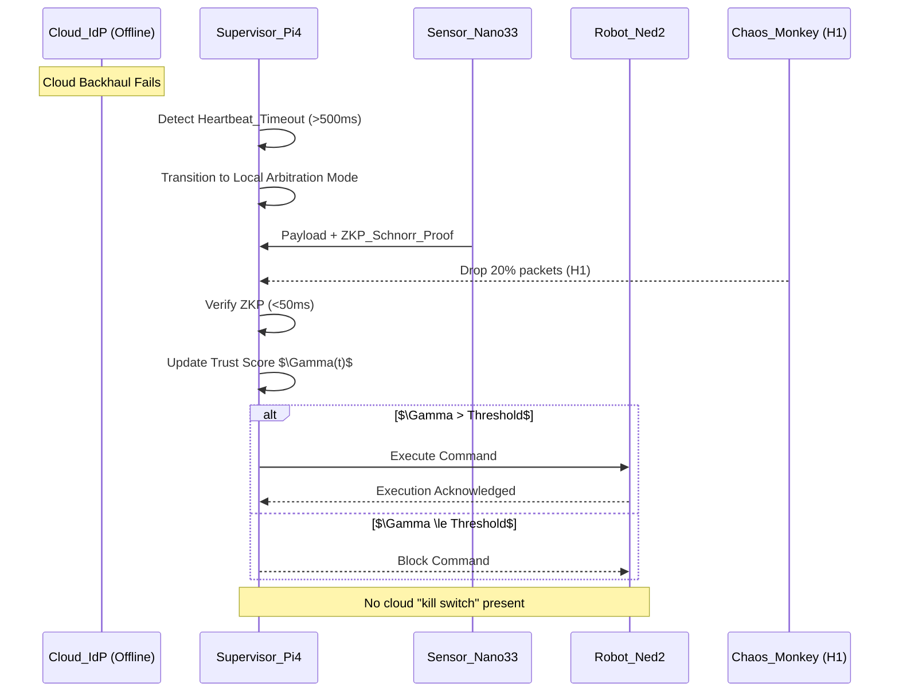

# SentryC2 Projected End-State Architecture (Thesis-Ready)

**Document Version:** 1.0  
**Date:** February 2, 2026  
**Phase:** Projected End-State (Post $H_1$, $H_2$, $H_3$)  
**Tone:** Mission-First, Objective, Technical

---

## 1) THESIS-READY REPOSITORY TREE (PROJECTED)

```
SentryC2/
├── .github/
│   └── copilot-instructions.md                 # Constitution (Mission-First Protocols) [Source 22]
├── Dockerfile                                   # Dev container (ROS2 Humble)
├── docker-compose.yml                           # Dev orchestration
├── deploy/
│   ├── Dockerfile.edge                          # Headless Pi4 edge build
│   └── docker-compose.prod.yml                  # Production deployment (Pi4 cluster)
├── docs/
│   ├── ADR/                                     # Architecture Decision Records [Source 583]
│   │   ├── 0001-zkp-vs-ecc.md                    # ZKP vs ECC decision log
│   │   └── 0002-libsecp256k1-vs-schnorr.md       # Crypto library selection
│   ├── architecture/
│   │   ├── current.md                            # Baseline (Phase 1)
│   │   ├── plan.md                               # Roadmap (H1/H2/H3)
│   │   └── projectedstruct.md                    # THIS FILE
│   ├── engineering_notes/                        # ADB/VR protocols, field notes
│   ├── PSAC.md                                   # Pre-Safety Argument Case
│   ├── SVP.md                                    # Software Verification Plan
│   ├── REQUIREMENTS.md                           # Requirements baseline
│   └── CM_CONFIGURATION_REPORT.md                # Configuration management
├── experiments/
│   ├── h1_resilience/                            # H1 packet-loss experiments [Source 38]
│   │   ├── chaos_monkey_benchmark.py
│   │   └── results_h1.csv
│   ├── h2_security_tax/                          # H2 security tax benchmarking [Source 34]
│   │   ├── zkp_vs_ecc_latency.py
│   │   └── results_h2.csv
│   └── h3_scalability/
│       ├── gossip_scale_test.py
│       └── results_h3.csv
├── ros2_ws/
│   └── src/
│       ├── ROS-TCP-Endpoint/                     # Unity bridge
│       └── sentry_logic/
│           ├── nodes/
│           │   ├── cyclic_action_server.py       # ROS2 action server
│           │   ├── niryo_tcp_bridge.py           # Niryo TCP interface
│           │   ├── chaos_monkey.py               # H1 packet loss injector [Source 38]
│           │   └── zkp_auth_server.py            # H2 Schnorr verification [Source 34]
│           ├── lib/
│           │   ├── trust_score.py                # Γ(t+1) = α·Γ(t) [Source 7]
│           │   └── packet_metrics.py             # Loss/latency telemetry
│           ├── launch/
│           │   └── sentry_logic.launch.py
│           ├── interfaces/
│           │   ├── srv/VerifyZKP.srv
│           │   └── msg/TrustScore.msg
│           └── package.xml
├── Sentry_Simulation/                            # Unity 6 project (VR/AR)
│   ├── Assets/
│   ├── Packages/
│   └── ProjectSettings/
└── tests/
    ├── verify_docker_reproducibility.sh
    └── traceability_matrix.csv
```

---

## 2) EDGE-FIRST COMMUNICATION TOPOLOGY (CONTESTED ENVIRONMENT)



---

## 3) SECURITY TAX DATA FLOW (H2 VALIDATION)

```mermaid
graph TD
    A[Command_Vector] --> B[Capture timestamp_start]
    B --> C{Auth Path}

    C -->|Baseline| D[ECC Sign/Verify]
    D --> E[Capture timestamp_end]
    E --> F[Compute Δt_baseline]

    C -->|Target| G[ZKP Prover (Nano33)]
    G --> H[Network Transit]
    H --> I[ZKP Verifier (Pi4)]
    I --> J[Capture timestamp_end]
    J --> K[Compute Δt_target]

    F --> L[Security Tax Δt = Δt_target - Δt_baseline]
    K --> L
```

---

## 4) MODULE INTERFACES (FAR PART 7 COMPLIANCE)

### 4.1 Cryptography (Make vs. Buy Constraint)
- **Approved Libraries Only:**
  - `libsecp256k1` **OR** vetted `schnorr-nizk` library.
- **Prohibited:** Custom cryptographic math or ad-hoc ECC implementations.
- **Interface Contract:**
  - **Input:** `challenge_nonce`, `payload_hash`, `prover_public_key`.
  - **Output:** `zkp_proof`, `verification_result` (bool), `latency_ms`.
- **Rationale:** Prevents unverified crypto in safety-critical pipeline; aligns with FAR Part 7 acquisition logic.

### 4.2 Transport & Network Manipulation
- **Transport:** ROS2 DDS (FastDDS or rmw_cyclonedds_cpp per system baseline).
- **Network Testing:** `scapy` for packet loss injection (H1 Chaos Monkey).
- **Interface Contract:**
  - **Input:** `ROS2 topic`, `loss_rate`, `burst_pattern`.
  - **Output:** `packet_drop_metrics`, `latency_p50`, `latency_p99`.
- **Constraint:** No blocking calls inside callbacks; state machines only.

---

## 5) OPERATIONAL GUARANTEES (THESIS-READY)

- **$H_1$ Resilience:** Sustains 20% packet loss with ≥95% command success.
- **$H_2$ Security Tax:** ZKP auth latency $<70ms$ (Pi4), with ≥99.9% verification success.
- **$H_3$ Scalability:** Gossip consensus stable for $n=10$ without livelock; decision latency increase ≤10%.

---

## 6) FINAL ASSERTION

This projected structure is the authoritative **North Star** for SentryC2’s thesis deliverables and dual-use commercialization path. It enforces:
- deterministic architecture evolution,
- validated acquisition logic (make vs. buy),
- and explicit DO-178C traceability.
