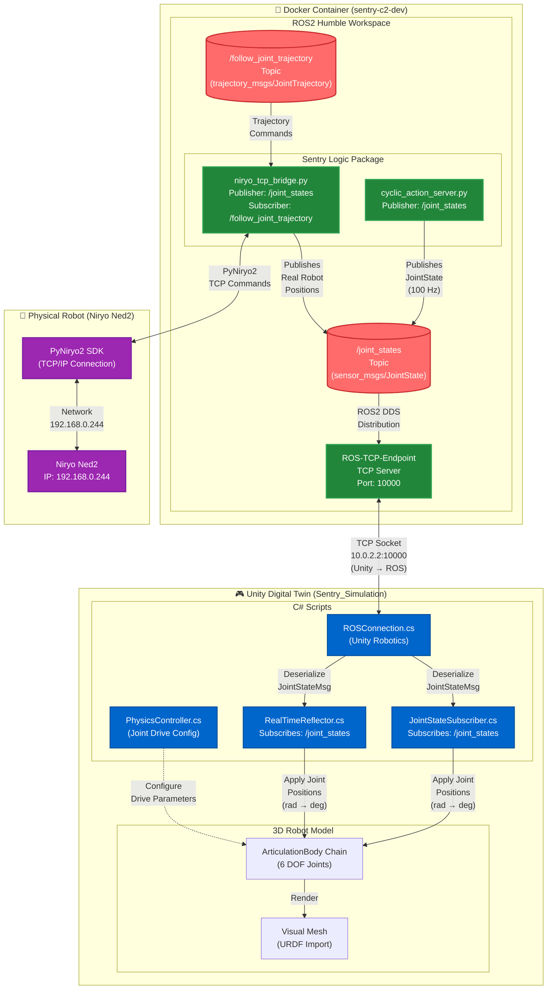

# SentryC2 Robot Communication Flow

This document details the complete communication architecture between the physical Niryo Ned2 robot, ROS2 middleware, Unity digital twin, and the Docker containerized environment.

## Architecture Overview

The SentryC2 system uses a bi-directional communication pattern where:
- **ROS2** acts as the central middleware hub
- **Unity** serves as the digital twin visualization
- **Docker** provides the isolated runtime environment
- **Physical Robot** (Niryo Ned2) connects via TCP/IP

---

## Communication Flow Diagram



---

## Detailed Component Breakdown

### 1. Docker Environment

**File:** `docker-compose.yml`, `Dockerfile`

The Docker container provides:
- **Isolated ROS2 Humble environment**
- **Network Mode:** `host` (allows direct access to ROS2 DDS multicast)
- **ROS_DOMAIN_ID:** `0` (matches Unity ROS settings)
- **Volumes:** Workspace mounted at `/workspace`

**Key Environment Variables:**
```bash
ROS_DOMAIN_ID=0
ROS_LOCALHOST_ONLY=0
DISPLAY=${DISPLAY}  # For GUI tools (rviz2, rqt)
```

---

### 2. ROS2 Publishers (Data Sources)

#### 2.1 Cyclic Action Server

**File:** `ros2_ws/src/sentry_logic/sentry_logic/cyclic_action_server.py`

**Purpose:** Simulated robot controller for testing "kill switch" authorization scenarios

**Functionality:**
- Publishes to `/joint_states` at 100 Hz (0.05s interval in trajectory)
- Cycles between `POSE_HOME` and `POSE_TARGET` every 2 seconds
- Implements authorization expiration simulation (10-second kill switch)
- Interpolates smooth trajectories between waypoints

**Message Format:**
```python
sensor_msgs/JointState
  - name: ['joint_1', 'joint_2', 'joint_3', 'joint_4', 'joint_5', 'joint_6']
  - position: [rad, rad, rad, rad, rad, rad]  # 6 joint angles in radians
```

**Flow:**
```
POSE_HOME → Interpolate 100 steps → POSE_TARGET → Interpolate 100 steps → POSE_HOME
```

---

#### 2.2 Niryo TCP Bridge

**File:** `ros2_ws/src/sentry_logic/sentry_logic/niryo_tcp_bridge.py`

**Purpose:** Bidirectional bridge between physical Niryo Ned2 robot and ROS2

**Publishers:**
- Topic: `/joint_states`
- Rate: 10 Hz (configurable via `publish_rate` parameter)
- Source: Real-time joint positions from `pyniryo2.NiryoRobot.arm.get_joints()`

**Subscribers:**
- Topic: `/niryo_robot_follow_joint_trajectory_controller/follow_joint_trajectory`
- Type: `trajectory_msgs/JointTrajectory`
- Action: Executes trajectory on physical robot using PyNiryo2 SDK

**Connection:**
```python
robot = NiryoRobot('192.168.0.244')  # TCP/IP to physical robot
robot.arm.calibrate_auto()           # Auto-calibration on startup
```

**Threading Model:**
- Main thread: Publishes joint states at 10 Hz
- Background thread: Executes trajectories (prevents blocking)

---

### 3. ROS-TCP-Endpoint (Unity Bridge)

**Package:** `ros2_ws/src/ROS-TCP-Endpoint/`

**Purpose:** TCP server that bridges ROS2 topics/services to Unity via TCP sockets

**Architecture:**
- **Server Node:** `default_server_endpoint.py` runs as ROS2 node "UnityEndpoint"
- **TCP Server:** Binds to `0.0.0.0:10000` (accepts connections from any IP)
- **Protocol:** Custom binary serialization of ROS messages

**Key Components:**
1. **TcpServer** (`server.py`): Main server class
   - Accepts incoming Unity connections
   - Spawns `ClientThread` for each connection
   - Manages publisher/subscriber tables

2. **UnityTcpSender** (`tcp_sender.py`): 
   - Serializes ROS messages to Unity-compatible format
   - Sends messages over TCP socket

3. **RosSubscriber** (`subscriber.py`):
   - Subscribes to ROS2 topics
   - Forwards messages to Unity via TCP

**Data Flow:**
```
ROS2 Topic → RosSubscriber → UnityTcpSender → TCP Socket → Unity
Unity → TCP Socket → ClientThread → ROS2 Publisher
```

---

### 4. Unity Digital Twin

#### 4.1 ROS Connection Layer

**Script:** `ROSConnection.cs` (Unity Robotics Hub package)

**Configuration:**
- **ROS IP:** `10.0.2.2` (Docker host IP from Unity's perspective)
- **ROS Port:** `10000`
- **Protocol:** ROS2

**Functionality:**
- Establishes TCP connection to ROS-TCP-Endpoint
- Manages message serialization/deserialization
- Provides `Subscribe<T>()` and `Publish<T>()` APIs

**Debug Script:** `ROSConnectionDebug.cs`
- Monitors connection status every 2 seconds
- Logs connection errors (auto-disables after 4 failed attempts)

---

#### 4.2 Joint State Subscriber

**Script:** `JointStateSubscriber.cs`

**Purpose:** Receives `/joint_states` messages and applies positions to Unity robot model

**Process Flow:**
1. **Subscribe:** Registers callback for `sensor_msgs/JointState` on `/joint_states`
2. **Receive Message:** Callback `OnJointStateReceived(JointStateMsg msg)` triggered
3. **Map Joint Names:** Converts ROS joint names to Unity link names
   ```csharp
   "joint_1" → "shoulder_link"
   "joint_2" → "arm_link"
   "joint_3" → "elbow_link"
   "joint_4" → "forearm_link"
   "joint_5" → "wrist_link"
   "joint_6" → "hand_link"
   ```
4. **Unit Conversion:** Radians → Degrees (`position * Mathf.Rad2Deg`)
5. **Apply to Model:** Sets `ArticulationBody.xDrive.target` for each joint

**Joint Hierarchy:**
```
base_link (fixed)
  └─ shoulder_link (revolute, joint_1)
      └─ arm_link (revolute, joint_2)
          └─ elbow_link (revolute, joint_3)
              └─ forearm_link (revolute, joint_4)
                  └─ wrist_link (revolute, joint_5)
                      └─ hand_link (revolute, joint_6)
```

---

#### 4.3 Real-Time Reflector

**Script:** `RealTimeReflector.cs`

**Purpose:** Alternative subscriber for direct joint mapping (no name conversion)

**Difference from JointStateSubscriber:**
- Uses direct array index mapping (assumes joint order matches)
- Requires manual assignment of `unityJoints` list in Inspector
- Faster execution (no name lookup)
- Less flexible (order-dependent)

**Usage:** Preferred when joint order is guaranteed to match ROS message order

---

#### 4.4 Physics Controller

**Script:** `PhysicsController.cs`

**Purpose:** Configures physics simulation parameters for ArticulationBody joints

**Configured Parameters:**
- **Stiffness:** 10,000 (joint drive spring constant)
- **Damping:** 1,000 (joint drive damping coefficient)
- **Force Limit:** 1,000 N (max torque)
- **Joint Friction:** 10
- **Angular Damping:** 10

**Impact:** Determines how smoothly/stiffly the Unity robot follows ROS commands

---

### 5. Physical Robot (Niryo Ned2)

**Hardware:** Niryo Ned2 6-axis collaborative robot

**Connection:**
- **IP Address:** `192.168.0.244` (configured in niryo_tcp_bridge.py)
- **SDK:** PyNiryo2 (Python library for Niryo robot control)
- **Protocol:** TCP/IP (proprietary Niryo protocol)

**Capabilities:**
- Read joint positions: `robot.arm.get_joints()`
- Execute trajectories: `robot.arm.move_joints(positions)`
- Calibration: `robot.arm.calibrate_auto()`

---

## Data Flow Sequences

### Sequence 1: Simulated Robot → Unity

```
┌──────────────────┐        ┌──────────────┐        ┌──────────────┐        ┌─────────────┐
│ Cyclic Action    │        │ ROS2 DDS     │        │ ROS-TCP      │        │   Unity     │
│ Server           │        │ Middleware   │        │ Endpoint     │        │ Digital Twin│
└────────┬─────────┘        └──────┬───────┘        └──────┬───────┘        └──────┬──────┘
         │                         │                       │                       │
         │ Publish JointState      │                       │                       │
         │ (100 Hz, interpolated)  │                       │                       │
         ├────────────────────────>│                       │                       │
         │                         │                       │                       │
         │                         │ DDS Topic Forward     │                       │
         │                         ├──────────────────────>│                       │
         │                         │                       │                       │
         │                         │                       │ TCP Serialize & Send  │
         │                         │                       ├──────────────────────>│
         │                         │                       │                       │
         │                         │                       │                       │ Deserialize
         │                         │                       │                       │ JointStateMsg
         │                         │                       │                       │
         │                         │                       │                       │ Map Joint Names
         │                         │                       │                       │ (joint_1 → shoulder_link)
         │                         │                       │                       │
         │                         │                       │                       │ Convert rad → deg
         │                         │                       │                       │
         │                         │                       │                       │ Apply to
         │                         │                       │                       │ ArticulationBody
         │                         │                       │                       │ (xDrive.target)
         │                         │                       │                       │
         │                         │                       │                       │ Physics
         │                         │                       │                       │ Simulation
         │                         │                       │                       │ Update
         │                         │                       │                       │
```

---

### Sequence 2: Physical Robot → Unity

```
┌──────────────────┐        ┌──────────────┐        ┌──────────────┐        ┌─────────────┐
│ Niryo Ned2       │        │ Niryo TCP    │        │ ROS-TCP      │        │   Unity     │
│ (Physical Robot) │        │ Bridge       │        │ Endpoint     │        │ Digital Twin│
└────────┬─────────┘        └──────┬───────┘        └──────┬───────┘        └──────┬──────┘
         │                         │                       │                       │
         │                         │ PyNiryo2: Get Joints  │                       │
         │                         │ (10 Hz Timer)         │                       │
         │<────────────────────────┤                       │                       │
         │                         │                       │                       │
         │ Return Current Positions│                       │                       │
         ├────────────────────────>│                       │                       │
         │ [j1, j2, j3, j4, j5, j6]│                       │                       │
         │                         │                       │                       │
         │                         │ Publish /joint_states │                       │
         │                         ├──────────────────────>│                       │
         │                         │                       │                       │
         │                         │                       │ TCP Send              │
         │                         │                       ├──────────────────────>│
         │                         │                       │                       │
         │                         │                       │                       │ Apply to Model
         │                         │                       │                       │ (Same as Seq 1)
         │                         │                       │                       │
```

---

### Sequence 3: Unity → Physical Robot (Future/Trajectory Execution)

```
┌─────────────┐        ┌──────────────┐        ┌──────────────┐        ┌──────────────────┐
│   Unity     │        │ ROS-TCP      │        │ Niryo TCP    │        │ Niryo Ned2       │
│ (Trajectory)│        │ Endpoint     │        │ Bridge       │        │ (Physical Robot) │
└──────┬──────┘        └──────┬───────┘        └──────┬───────┘        └────────┬─────────┘
       │                      │                       │                         │
       │ Publish Trajectory   │                       │                         │
       ├─────────────────────>│                       │                         │
       │ (JointTrajectory)    │                       │                         │
       │                      │                       │                         │
       │                      │ ROS2 Topic Forward    │                         │
       │                      ├──────────────────────>│                         │
       │                      │                       │                         │
       │                      │                       │ Execute Trajectory      │
       │                      │                       │ (Background Thread)     │
       │                      │                       ├────────────────────────>│
       │                      │                       │                         │
       │                      │                       │                         │ Move Joints
       │                      │                       │                         │ (Physical Motion)
       │                      │                       │                         │
```

---

## Network Topology

```
┌─────────────────────────────────────────────────────────────┐
│                   Physical Network                          │
│                                                             │
│  ┌──────────────────┐          ┌──────────────────┐        │
│  │   Docker Host    │          │  Niryo Ned2      │        │
│  │   10.0.2.2       │          │  192.168.0.244   │        │
│  │                  │          │                  │        │
│  │  ┌────────────┐  │          └──────────────────┘        │
│  │  │ Docker     │  │                   ▲                  │
│  │  │ Container  │  │                   │                  │
│  │  │ (host net) │  │                   │ PyNiryo2         │
│  │  │            │  │                   │ TCP/IP           │
│  │  │ ROS-TCP    │  │                   │                  │
│  │  │ Endpoint   │  │          ┌────────┴─────────┐        │
│  │  │ Port:10000 │◄─┼──────────┤ niryo_tcp_bridge │        │
│  │  └────────────┘  │          │ (ROS2 Node)      │        │
│  │        ▲         │          └──────────────────┘        │
│  │        │         │                                      │
│  └────────┼─────────┘                                      │
│           │                                                │
│           │ TCP Socket (10.0.2.2:10000)                    │
│           │                                                │
│  ┌────────┼─────────────────────────────┐                 │
│  │        │        Unity Editor          │                 │
│  │        │                              │                 │
│  │  ┌─────▼──────────┐                  │                 │
│  │  │ ROSConnection  │                  │                 │
│  │  │                │                  │                 │
│  │  │  ┌──────────┐  │                  │                 │
│  │  │  │ Joint    │  │                  │                 │
│  │  │  │ State    │  │                  │                 │
│  │  │  │ Sub      │  │                  │                 │
│  │  │  └────┬─────┘  │                  │                 │
│  │  │       │        │                  │                 │
│  │  │       ▼        │                  │                 │
│  │  │  ┌──────────┐  │                  │                 │
│  │  │  │Articulate│  │                  │                 │
│  │  │  │Bodies    │  │                  │                 │
│  │  │  └──────────┘  │                  │                 │
│  │  └────────────────┘                  │                 │
│  └──────────────────────────────────────┘                 │
│                                                            │
└────────────────────────────────────────────────────────────┘
```

---

## Message Format Specifications

### JointState Message

**ROS2 Type:** `sensor_msgs/msg/JointState`

**Structure:**
```python
std_msgs/Header header
  uint32 seq
  builtin_interfaces/Time stamp
  string frame_id
  
string[] name          # Joint names: ['joint_1', 'joint_2', ...]
float64[] position     # Joint angles in RADIANS
float64[] velocity     # Joint velocities (optional)
float64[] effort       # Joint torques (optional)
```

**Example:**
```python
JointState(
    name=['joint_1', 'joint_2', 'joint_3', 'joint_4', 'joint_5', 'joint_6'],
    position=[0.0, -0.7, -0.7, 0.0, -0.5, 0.0]  # Radians
)
```

**Unity Conversion:**
```csharp
float degrees = (float)msg.position[i] * Mathf.Rad2Deg;  // Radians → Degrees
drive.target = degrees;  // Apply to ArticulationBody
```

---

### JointTrajectory Message

**ROS2 Type:** `trajectory_msgs/msg/JointTrajectory`

**Structure:**
```python
std_msgs/Header header
string[] joint_names
JointTrajectoryPoint[] points
  float64[] positions
  float64[] velocities
  float64[] accelerations
  float64[] effort
  builtin_interfaces/Duration time_from_start
```

**Usage:** Commands the robot to follow a time-sequenced trajectory

---

## Launch Commands

### Start ROS2 Environment (Docker)

```bash
# Start Docker container
docker-compose up -d

# Attach to container
docker exec -it sentry-c2-dev /bin/bash

# Source ROS2
source /opt/ros/humble/setup.bash
source /workspace/ros2_ws/install/setup.bash
```

### Launch ROS-TCP-Endpoint

```bash
# Terminal 1: Start Unity Bridge
ros2 run ros_tcp_endpoint default_server_endpoint
```

### Launch Cyclic Action Server (Simulation)

```bash
# Terminal 2: Start Simulated Robot
ros2 run sentry_logic cyclic_action_server
```

### Launch Niryo TCP Bridge (Physical Robot)

```bash
# Terminal 3: Start Physical Robot Bridge
ros2 run sentry_logic niryo_tcp_bridge --ros-args \
  -p robot_ip:=192.168.0.244 \
  -p publish_rate:=10.0
```

### Monitor Joint States

```bash
# Terminal 4: Echo joint states
ros2 topic echo /joint_states
```

### Launch Unity

1. Open `Sentry_Simulation` project in Unity Hub
2. Open scene: `Assets/Scenes/[YourScene].unity`
3. Ensure ROSConnection settings:
   - ROS IP: `10.0.2.2`
   - ROS Port: `10000`
   - Protocol: `ROS2`
4. Press **Play**

---

## Communication Arrays & Data Structures

### Unity ArticulationBody Array

**File:** `JointStateSubscriber.cs`

```csharp
private ArticulationBody[] articulationChain;

void Start() {
    articulationChain = GetComponentsInChildren<ArticulationBody>();
    // Returns array of all joint components in hierarchy order
}
```

**Order (URDF-defined):**
```
[0] base_link (fixed)
[1] shoulder_link (revolute)
[2] arm_link (revolute)
[3] elbow_link (revolute)
[4] forearm_link (revolute)
[5] wrist_link (revolute)
[6] hand_link (revolute)
```

### ROS JointState Arrays

**Parallel Arrays:**
```python
msg.name = ['joint_1', 'joint_2', 'joint_3', 'joint_4', 'joint_5', 'joint_6']
msg.position = [0.0, -0.7, -0.7, 0.0, -0.5, 0.0]  # Radians
```

**Index Mapping:**
- `name[i]` corresponds to `position[i]`
- Unity must map `name[i]` to correct `ArticulationBody`

### RealTimeReflector Unity Joints List

**File:** `RealTimeReflector.cs`

```csharp
public List<ArticulationBody> unityJoints;  // Manually assigned in Inspector

void UpdateRobotPose(SensorJointState msg) {
    for (int i = 0; i < unityJoints.Count; i++) {
        float degrees = (float)msg.position[i] * Mathf.Rad2Deg;
        unityJoints[i].xDrive.target = degrees;  // Direct array index mapping
    }
}
```

---

## Key Configuration Files

### Docker Configuration

**File:** `docker-compose.yml`
- Network: `host` (allows ROS2 DDS multicast)
- Environment: `ROS_DOMAIN_ID=0`
- Port: 10000 exposed via host network

### Unity ROS Settings

**File:** `Assets/Resources/ROSConnectionPrefab.prefab` (auto-generated)
- ROS IP Address: `10.0.2.2`
- ROS Port: `10000`
- Protocol: `ROS2`
- Show HUD: `true`

### ROS2 Package Configuration

**File:** `ros2_ws/src/sentry_logic/package.xml`
- Dependencies: `rclpy`, `sensor_msgs`, `trajectory_msgs`

**File:** `ros2_ws/src/ROS-TCP-Endpoint/package.xml`
- Dependencies: `rclpy`, `std_msgs`, `geometry_msgs`

---

## Debugging & Troubleshooting

### Check ROS-TCP-Endpoint Connection

```bash
# Check if Unity is connected
ros2 topic list | grep unity
ros2 node list | grep Unity
```

### Verify Joint States Publishing

```bash
# Monitor /joint_states topic
ros2 topic hz /joint_states  # Check publish rate
ros2 topic echo /joint_states  # View messages
```

### Unity Connection Issues

**Script:** `ROSConnectionDebug.cs`
- Auto-logs connection status every 2 seconds
- Check Console for:
  - `✓ CONNECTED` (success)
  - `✗ DISCONNECTED` (failure)

**Common Issues:**
1. **Wrong IP:** Unity tries `127.0.0.1` instead of `10.0.2.2`
2. **Port Blocked:** Firewall blocking port 10000
3. **ROS-TCP-Endpoint Not Running:** Start `default_server_endpoint`

### Physical Robot Connection Issues

**Niryo Bridge Diagnostics:**
```bash
# Check if robot is reachable
ping 192.168.0.244

# Check PyNiryo2 connection in Python
python3 -c "from pyniryo2 import *; robot = NiryoRobot('192.168.0.244'); print(robot.arm.get_joints())"
```

---

## Kill Switch Architecture

### Centralized IdP Failure (Problem)

**Traditional Industry 4.0:**
```
Cloud IdP Unreachable → Authorization Lease Expires → Production Halts
```

**SentryC2 Solution:**
```
Edge-First ZKP → Local Authorization → Production Continues
```

### Kill Switch Simulation

**File:** `cyclic_action_server.py`

```python
def trigger_kill_switch(self):
    self.auth_token_valid = False  # Simulates IdP failure
    self.get_logger().warn('⚠️ KILL SWITCH ACTIVATED')
```

**Effect:**
- After 10 seconds, `execute_cycle()` returns without publishing
- Unity robot freezes in last position (no new JointState messages)
- Demonstrates centralized failure mode

---

## Performance Metrics

| Component                  | Rate     | Latency         | Protocol      |
|----------------------------|----------|-----------------|---------------|
| Cyclic Action Server       | 100 Hz   | ~0.05 ms        | ROS2 DDS      |
| Niryo TCP Bridge (Publish) | 10 Hz    | ~5-10 ms        | PyNiryo2 TCP  |
| ROS-TCP-Endpoint           | Variable | ~10-20 ms       | TCP Socket    |
| Unity Subscriber           | Variable | ~16-33 ms       | Unity Update  |
| **Total Latency (Sim→Unity)** | **—** | **~30-50 ms**   | **—**         |
| **Total Latency (Robot→Unity)** | **—** | **~50-100 ms** | **—**         |

**Notes:**
- Unity refresh rate depends on frame rate (60 FPS = 16 ms/frame)
- Network latency depends on TCP socket buffering
- Physical robot has mechanical lag (~100-200 ms)

---

## Future Enhancements

1. **Bidirectional Control:** Unity → ROS2 → Physical Robot
2. **ZKP Integration:** Replace `auth_token_valid` with Zero-Knowledge Proof verification
3. **Multi-Robot Support:** Fleet coordination with mesh networking
4. **Real-Time Collision Detection:** Unity physics → ROS2 safety stop
5. **State Machine Visualization:** Unity GUI for edge-first resiliency status

---

## References

- **ROS2 Documentation:** https://docs.ros.org/en/humble/
- **Unity Robotics Hub:** https://github.com/Unity-Technologies/Unity-Robotics-Hub
- **PyNiryo2 SDK:** https://docs.niryo.com/dev/pyniryo2/
- **SentryC2 Repository:** https://github.com/lpep64/SentryC2

---

## Glossary

| Term                  | Definition                                                                 |
|-----------------------|---------------------------------------------------------------------------|
| **ArticulationBody**  | Unity physics component for robotic joints (replaces deprecated HingeJoint) |
| **DDS**               | Data Distribution Service (ROS2 communication protocol)                   |
| **Digital Twin**      | Virtual replica of physical robot for simulation and monitoring           |
| **IdP**               | Identity Provider (authentication/authorization server)                   |
| **URDF**              | Unified Robot Description Format (XML for robot kinematics)               |
| **ZKP**               | Zero-Knowledge Proof (cryptographic verification without shared secrets)  |
| **Kill Switch**       | Safety mechanism that halts operations on failure (industry 4.0 problem)  |
| **Edge-First**        | Decentralized architecture where edge devices operate autonomously         |

---

**Document Version:** 1.0  
**Last Updated:** January 28, 2026  
**Author:** SentryC2 Development Team
